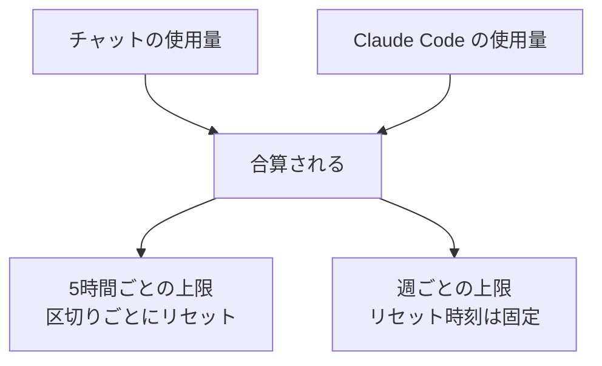
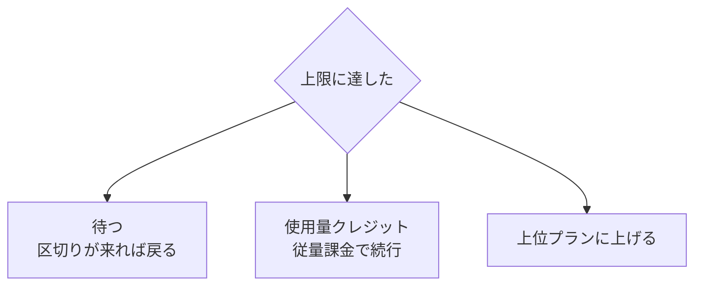

# 2. Pro を契約する

!!! abstract "このページでできるようになること"
    Pro プランを契約して Claude Code を使える状態にします。あわせて、**使用量の上限**という仕組みを先に理解しておきます。これを知らないと必ず驚きます。

## 無料では使えません

はっきり書いておきます。

!!! danger "Claude Code は有料プラン専用です"
    **無料（Free）プランでは Claude Code は使えません。Pro（月 $20）以上の契約が必要です。**

無料プランでできるのはチャットだけで、**このサイトの主題である Claude Code には到達しません。**

## 契約する

1. ブラウザで **[claude.ai](https://claude.ai)** を開きます
2. アカウントがなければ「Sign up」から作ります（Google アカウントまたはメールアドレス）
3. 画面内の **Upgrade**、または自分のアイコン → **Settings** → **Billing** を開きます
4. **Pro** を選び、クレジットカード情報を入力します
5. 決済が完了すると、その場で Pro になります

**料金（2026年8月時点）**

| | 月払い | 年払い |
|---|---|---|
| **Pro** | **$20 / 月** | $17 / 月相当（1年分を一括） |

まずは月払いで始め、続きそうなら年払いに変えるのが無難です。

!!! note "金額は変わることがあります"
    最新は公式の [料金ページ](https://claude.com/pricing) で確認してください。表示は米ドルで、請求時に円換算されます。海外決済がブロックされているカードだと通らないことがあります。

## 使用量の上限を先に理解する { #usage-limits }

Claude Code はチャットより消費が大きいので、仕組みを知らないと「急に止まった」と面食らいます。

### 2段構えになっています

**チャットと Claude Code は別枠ではなく合算**され、それぞれ「5時間ごと」と「週ごと」の2つの枠で見られます。

### 残量の見方

**Settings → Usage** に進捗バーがあり、5時間セッションと週の枠それぞれの消費量と、**次のリセットまでの残り時間**が分かります。大きな作業の前に見る癖をつけると、途中で止まって困ることが減ります。

<!-- TODO(画像): Settings → Usage の進捗バー。docs/assets/img/settings-usage.png -->

### 上限に達したら

!!! note "2026年8月時点の仕組みです"
    詳細は公式ヘルプの [使用量と上限について](https://support.claude.com/en/articles/11647753-how-do-usage-and-length-limits-work) を確認してください。

## 上位プラン（Max）について

Pro の枠を大きく増やした **Max** というプランがあります。Pro の 5倍・20倍の枠を持つ2種類が用意されています。

判断はシンプルで、**上限に頻繁にぶつかるようになったら検討する**だけです。そこまで使い込んでいれば必要かどうかは自分で判断がつきます。それまでは Pro で十分です（[料金ページ](https://claude.com/pricing)）。会社で複数人が使う Team / Enterprise もありますが、このサイトでは扱いません。

## やめ方（解約）

1. **Settings** → **Billing** を開く
2. 「Cancel subscription」を選ぶ

支払い済みの期間が終わるまでは Pro のまま使え、その後は自動的に無料プランへ戻ります。アカウントや過去の会話は残ります。

!!! warning "自動更新に注意"
    解約しない限り自動更新されます。「試しに1か月だけ」なら、使い始めた時点で解約手続きをしておくと安心です（その期間は使えます）。

[次へ：インストールする :material-arrow-right:](03-setup.md){ .md-button }
