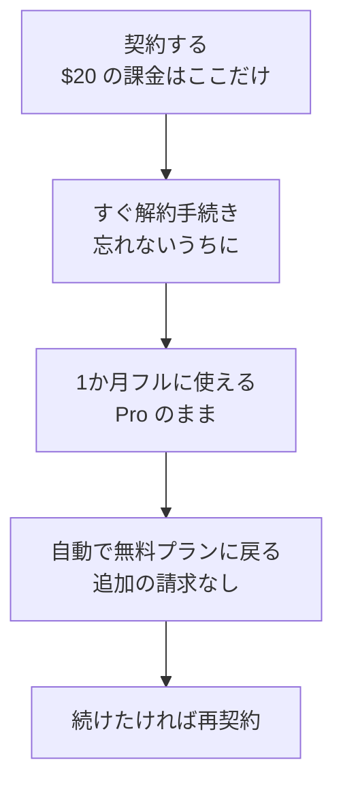
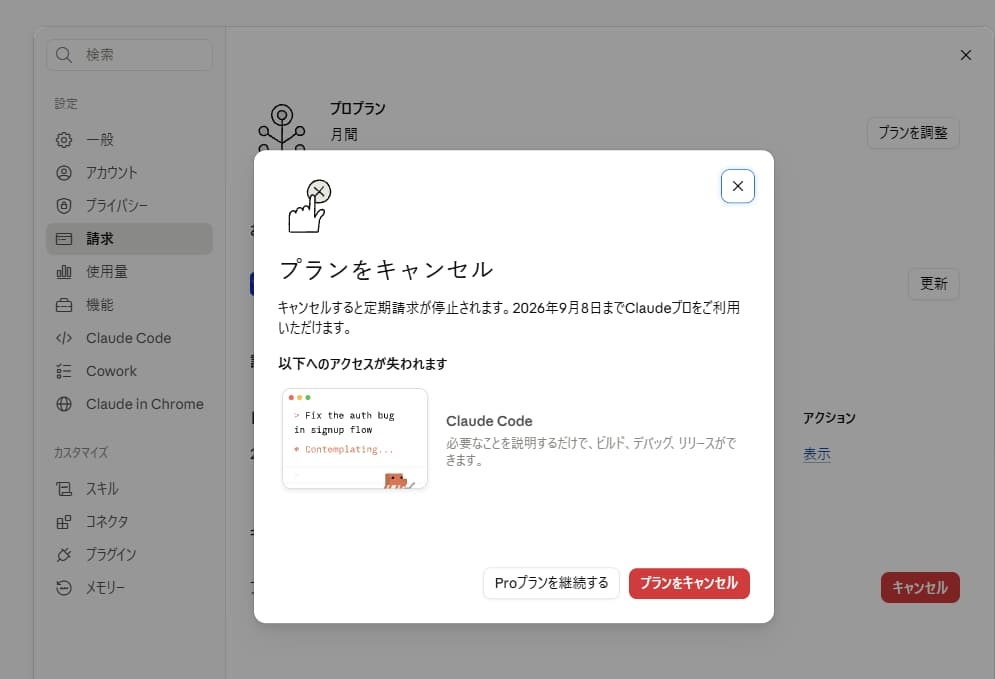

# 2. 契約して、すぐ解約して、入れる

!!! danger "Claude Code は有料プラン専用です"
    **無料プランでは使えません。Pro（月 $20）以上の契約が必要です。**

Pro に無料お試し期間はありません。ですが、**契約した直後に解約手続きをしておけば、課金は1回だけで1か月まるごと使えます。** これが実質のお試しです。



## 手順1: 契約する

1. ブラウザで **[claude.ai](https://claude.ai)** を開きます
2. アカウントがなければ「Sign up」から作ります（Google アカウントまたはメールアドレス）
3. 画面内の **Upgrade**、または左下の自分の名前 → **Settings** → **Billing** を開きます
4. **Pro** を選びます。**月払い**を選んでください（年払いだと1年分がまとめて請求されます）
5. カード情報を入力すると、その場で Pro になります

**Pro の料金は月 $20**（2026年8月時点、[料金ページ](https://claude.com/pricing)）。表示は米ドルで、請求時に円換算されます。

## 手順2: そのまま解約する

**契約したらすぐ、続けて解約手続きをしてください。** 左下の自分の名前 → **Settings** → **請求** → **キャンセル** と進むと、次の確認画面が出ます。



注目するのは**「キャンセルすると定期請求が停止されます。◯月◯日まで Claude プロをご利用いただけます」**の一文です。ここに**契約期間の終わりの日付**が出ています。

!!! success "解約しても、その日まで使えます"
    解約は**請求期間の終わりに反映**されます。それまでは Pro のまま、Claude Code もフルに使えます。

    「使い終わったら解約しよう」と後回しにすると忘れて課金されます。**先にやってしまうのが確実です。**

赤い **「プランをキャンセル」** を押したら、**そのまま次に進んでください。** Claude Code は問題なく使えます。続けたくなったら、期間が終わる前に契約し直せば途切れません。

期間が終わると Claude Code は使えなくなりますが、**作ったファイルは手元のパソコンにそのまま残ります。** アカウントも無料プランとして残り、チャットは引き続き使えます。

!!! note "使用量には上限があります"
    Claude Code はチャットより消費が大きく、**5時間ごと**の枠と**週ごと**の枠があります（チャットとの使用量は合算）。残量は **Settings → 使用量** で見られます。上限に達したらリセットを待てば戻ります。

!!! note "2026年8月時点の手順です"
    最新は公式ヘルプの [解約手順](https://support.claude.com/en/articles/8325617-cancel-your-pro-or-max-subscription) を確認してください（次回請求日の24時間前までに解約する必要があります）。

## 手順3: 下準備（Windows のみ）

=== "Windows"

    !!! warning "これが最大のつまずき所です"
        **手元のフォルダを扱うには [Git for Windows](https://git-scm.com/downloads/win) が必要**で、入れていないとフォルダを選んでも動きません。

        インストーラーの選択肢は多いですが、**すべて既定のまま「Next」を押し続けて構いません。**

=== "Mac"

    Git は多くの Mac に最初から入っています。通常は追加作業なしで次に進めます。

## 手順4: デスクトップアプリを入れる

**使うのはデスクトップアプリです。** ターミナル（黒い画面）は不要で、Claude Code が同梱されているので別途インストールも要りません。

=== "Windows"

    - [Windows (x64) 版](https://claude.ai/api/desktop/win32/x64/setup/latest/redirect) — ほとんどの方はこちら
    - [Windows (ARM64) 版](https://claude.ai/api/desktop/win32/arm64/setup/latest/redirect) — Surface など ARM 搭載機のみ

=== "Mac"

    - [macOS 版](https://claude.ai/api/desktop/darwin/universal/dmg/latest/redirect)（Intel / Apple Silicon 共通）

リンクが切れていたら [claude.com/download](https://claude.com/download) から辿れます。

## 手順5: サインインして Code タブを開く

1. アプリを起動します（Windows はスタートメニュー、Mac はアプリケーションフォルダ）
2. Claude アカウントでサインインします
3. **画面上部中央の「Code」タブ**をクリックします

これで準備完了です。隣の Chat タブは、ファイルに触らせない普通のチャットです。

## つまずいたら

| 症状 | 対処 |
|---|---|
| カードが通らない | 海外決済が制限されている可能性。カード会社に確認するか別のカードで |
| 確認メールが届かない | 迷惑メールを確認。会社アドレスは社内フィルタで止まることがあるので個人アドレスで試す |
| フォルダを選んでも動かない（Windows） | **Git for Windows** が入っていません。手順3へ |
| 「アップグレードしてください」と出る | まだ Pro になっていません。手順1へ |
| サインインできない / 403 | ブラウザで [claude.ai](https://claude.ai) にログインし直し、アプリを再起動 |

??? note "参考: ターミナル版（CLI）を入れる"

    コマンド操作に慣れている方向けです。動作が軽く、他のコマンドと組み合わせられます。

    === "Windows"

        PowerShell を開いて次の1行を実行し、**PowerShell を閉じて開き直して**から確認します。

        ```powershell
        irm https://claude.ai/install.ps1 | iex
        ```

        ```powershell
        claude --version
        ```

    === "Mac"

        ターミナルで次を実行し、ターミナルを開き直して確認します。

        ```bash
        curl -fsSL https://claude.ai/install.sh | bash
        ```

        ```bash
        claude --version
        ```

    作業フォルダに移動して `claude` と打つと起動します。初回はブラウザが開くのでサインインを。うまくいかないときは `claude doctor` で自己診断できます。エディタ拡張は VS Code の拡張機能検索で「Claude Code」を、手元に何も入れたくない場合は [claude.ai/code](https://claude.ai/code) をどうぞ。

[次へ：最初に動かす :material-arrow-right:](03-first-run.md){ .md-button }
