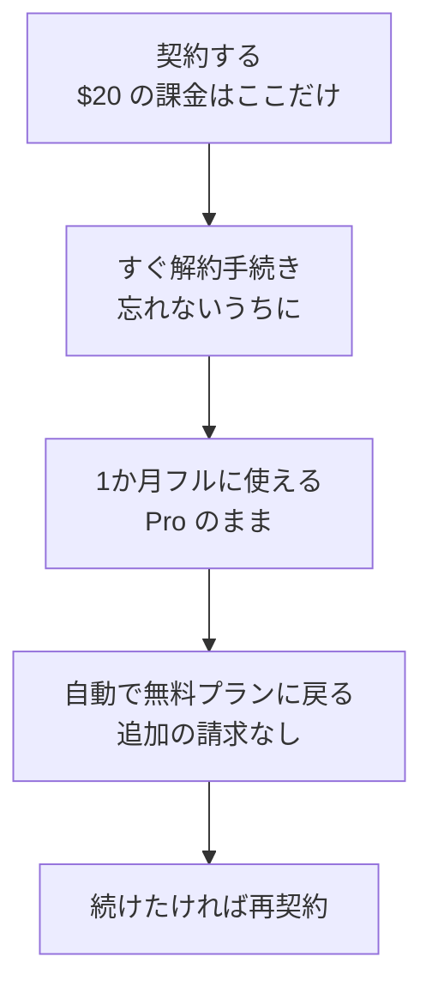

# 2. Pro を1か月試す

!!! danger "Claude Code は有料プラン専用です"
    **無料プランでは使えません。Pro（月 $20）以上の契約が必要です。**

Pro に無料お試し期間はありません。ですが、**契約した直後に解約手続きをしておけば、課金は1回だけで1か月まるごと使えます。** これが実質のお試しです。

## 手順1: 契約する

1. ブラウザで **[claude.ai](https://claude.ai)** を開きます
2. アカウントがなければ「Sign up」から作ります（Google アカウントまたはメールアドレス）
3. 画面内の **Upgrade**、または左下の自分の名前 → **Settings** → **Billing** を開きます
4. **Pro** を選びます。**月払い**を選んでください（年払いだと1年分がまとめて請求されます）
5. カード情報を入力すると、その場で Pro になります

**Pro の料金は月 $20**（2026年8月時点、[料金ページ](https://claude.com/pricing)）。表示は米ドルで、請求時に円換算されます。

## 手順2: そのまま解約する

**契約したらすぐ、続けて解約手続きをしてください。**

1. 左下の自分の名前 → **Settings** → **Billing**
2. **Cancel** を選ぶ

これで**次回の課金は発生しません。** そして重要なのは次の点です。

!!! success "解約しても、その1か月は使えます"
    解約は**請求期間の終わりに反映**されます。それまでは Pro のまま、Claude Code もフルに使えます。

    「使い終わったら解約しよう」と後回しにすると忘れて課金されます。**先にやってしまうのが確実です。**

解約手続きを終えたら、**そのまま次のページに進んでください。** Claude Code は問題なく使えます。

続けたくなったら、期間が終わる前に契約し直せば途切れません。

!!! note "2026年8月時点の手順です"
    最新は公式ヘルプの [解約手順](https://support.claude.com/en/articles/8325617-cancel-your-pro-or-max-subscription) を確認してください（次回請求日の24時間前までに解約する必要があります）。

## 1か月後にどうなるか

| 項目 | どうなるか |
|---|---|
| **Claude Code** | 使えなくなります |
| **作ったファイル** | **手元のパソコンにそのまま残ります。** 成果は消えません |
| **アカウント** | 無料プランとして残り、チャットは引き続き使えます |
| **再開したくなったら** | 契約し直せばすぐ使えます |

**1か月試して、作ったものが手元に残る。** 続けなかったとしても、これは残ります。

## 使用量には上限があります

Claude Code はチャットより消費が大きいので、これを知らないと「急に止まった」と面食らいます。

- **5時間ごと**の枠と、**週ごと**の枠の2段構え
- **チャットと Claude Code の使用量は合算**されます
- **Settings → Usage** で残量と次のリセット時刻が見られます

<!-- TODO(画像): Settings → Usage の進捗バー。docs/assets/img/settings-usage.png -->

上限に達したら、リセットを待つか、従量課金（使用量クレジット）で続けられます。1か月試すだけなら待てば十分です。

上限に頻繁にぶつかるようになったら、枠の大きい **Max** というプランもあります（[料金ページ](https://claude.com/pricing)）。そこまで使い込んでいれば必要かどうかは自分で判断できます。

## 契約でつまずいたら

| 症状 | 対処 |
|---|---|
| カードが通らない | 海外決済が制限されている可能性。カード会社に確認するか別のカードで |
| 確認メールが届かない | 迷惑メールを確認。会社アドレスは社内フィルタで止まることがあるので個人アドレスで試す |
| Code タブで「アップグレード」と出る | まだ Pro になっていません。Settings → Billing を確認 |

[次へ：インストールする :material-arrow-right:](03-install.md){ .md-button }
