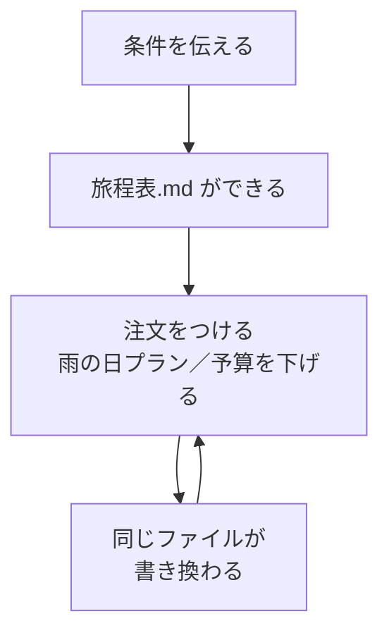
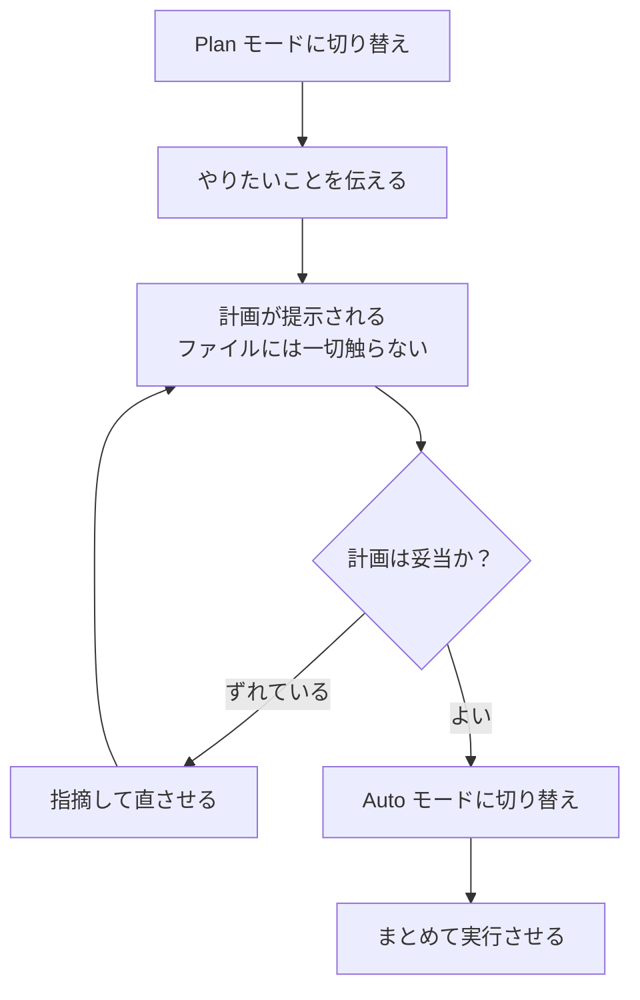

# 3. 最初に動かす

ここで**1つだけ**実際に動かします。**手元に材料は要りません。** このページを開いたまま進められます。

## 始める前に

Claude Code は**本当にファイルを書き換えます。** 渡すフォルダを選ぶ基準は **「このフォルダを、社外の取引先にそのまま送れるか？」** の一点です。機密や個人情報が混じるなら、問題ないファイルだけを別フォルダにコピーして渡してください。入力内容は Anthropic のサーバへ送られるため、会社の情報を扱うなら所属先のルールを先に確認を。

**今回は空のフォルダを使うので、この心配はありません。**

## 手順1: 空のフォルダを作る

デスクトップなどに `claude-test` という名前で**空のフォルダ**を1つ作ってください。中身は要りません。

## 手順2: そのフォルダを開く

1. デスクトップアプリの **Code** タブを開きます
2. 環境を選ぶ画面で **Local** を選びます（手元のパソコンのファイルを扱うモード。Cloud や SSH は今回使いません）
3. **Select folder** をクリックし、さきほど作った `claude-test` を選びます

## 手順3: 旅程表を作らせる

入力欄に次を貼り付けてください。`〈〉` の中だけ、ご自身の条件に書き換えます。**日付は必ず入れてください**（定休日を調べるのに必要です）。

```text
〈京都〉への旅行を計画しています。旅程表を作ってください。

【行き方】
- 〈2026年10月10日〉から〈2泊3日〉
- 〈大人2名〉、〈東京〉から出発
- 予算は交通費を除いて〈1人5万円〉まで
- 〈寺社と食べ歩き〉に興味があります

【お願い】
- 移動時間を考慮し、1日に詰め込みすぎないでください
- 各スポットの営業時間と定休日を調べ、その日に行けない場所があれば指摘してください
- 概算費用を項目ごとに書き、合計も出してください
- 調べた情報の出典URLを添えてください

結果を 旅程表.md というファイルに保存してください。
```

送信すると、Claude Code は**自分で調べ、旅程を組み立て、`旅程表.md` というファイルを作ります。** 数分かかります。

!!! info "途中で確認を求められたら"
    Web を見にいくときやファイルを作るときに、**「実行してよいか」を尋ねてくることがあります。** 内容を読んで承認してください。今回は空フォルダなので、承認して問題ありません。

できあがったら、アプリの左側に出るファイル名をクリックすると中身が見られます。**それがあなたの成果物です。**

!!! tip "人に渡したいとき"
    `.md` はテキストファイルなので、メモ帳などでも開けます。**家族に見せたいなら「旅程表をHTMLにして」と頼んでください。** ブラウザで開ける1枚のページになり、そのまま送れます。

!!! warning "値段と営業時間は必ず自分で確認を"
    Web で調べた情報をもとにしていますが、**古い情報が混ざることがあります。** 実際に予約や移動をする前に、公式サイトで確認してください。出典URLを出させているのはこのためです。

## 手順4: 条件を変えて作り直させる

**ここからが本番です。** 続けてこう頼んでみてください。

```text
2日目を雨の日プランに差し替えてください。
```

```text
予算を1人4万円に下げてください。削った項目が分かるようにしてください。
```



チャットでも旅程は作れます。**違うのはここから先です。** 成果物が**ファイルとして残り**、何度でも**作り直せて**、そのまま**家族に渡せます。**

「作って終わり」ではなく「**手元に置いて育てられる**」——これが Claude Code です。

## 進め方：Plan で計画、Auto で実行

送信ボタンの隣に**権限モード**の選択肢があります。短い作業ならそのままで構いませんが、**大きな作業では次の流れが効きます。**



**Plan モード**はファイルを変更しません。ここで方針を確認しておけば、**Auto モード**で一気に進めさせても安心です。1つずつ差分を見て承認したいときは **Manual モード**を使います。

違う方向に進み始めたら**停止ボタン**で止められます。止めずに追加の指示を送って軌道修正することもできるので、最後まで待つ必要はありません。

## `CLAUDE.md`：毎回の説明をやめる

作業フォルダに **`CLAUDE.md`** を置いておくと、Claude Code は毎回それを読んでから作業を始めます。

```markdown
# このフォルダについて

営業部の月次報告書を管理しています。

- 日付は「2026年8月20日」の形式に統一してください
- 金額は3桁区切りで書いてください
- `archive/` フォルダの中身は変更しないでください
```

**同じ注意を2回書いたら `CLAUDE.md` に移すサイン**です。`/init` と入力すれば、Claude がフォルダを調べてたたき台を作ってくれます。

## 他にもこんなことができます

**気になったものを、そのまま日本語で頼めば動きます。** 専用のコマンドはありません。

- **資料の横断まとめ** — フォルダ内の資料を全部読んで、論点ごとの一覧表を1ファイルに
- **議事録の棚卸し** — 半年分の議事録から、未完了の宿題を担当・期限つきで抽出
- **家計簿の集計** — CSV を費目別・月別に集計し、前年比つきのレポートに
- **写真フォルダの整理** — 撮影日と内容でフォルダ分けしてリネーム
- **家電の比較検討** — 条件を伝えて候補を調べさせ、比較表をファイルに残す
- **自分用の Web ページ** — レシピ集やリンク集を1ページに。**このサイトもそうやって作りました**

!!! tip "ファイルを書き換えさせるときの型"
    指示の最後に **「まず1つだけやって見せてください。それでよければ残りを進めてください」** と付けてください。いきなり全部書き換えられる事故を防げます。この一言はどの作業でも使い回せます。

出てきたものの責任は使った人にあります。**数字・日付・固有名詞は自分で確認してから使ってください。** 「AI がやった」は通用しません。

このサイトが案内するのはここまでです。**あとは実際に使いながら覚えるのがいちばん速い**ので、次のページのリンクをどうぞ。

[次へ：この先は自分で :material-arrow-right:](04-next.md){ .md-button }
