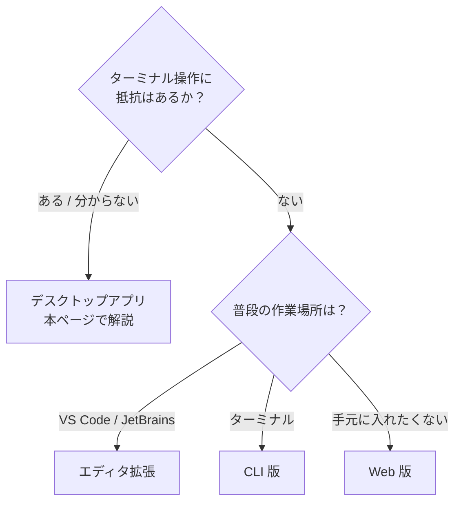

# 3. インストールする

**デスクトップアプリを使います。** ターミナル（黒い画面）は不要で、変更内容が画面上で確認でき、Claude Code が同梱されているので別途インストールも要りません。



## 手順1: 下準備（Windows のみ必要）

=== "Windows"

    !!! warning "これが最大のつまずき所です"
        **手元のフォルダを扱うには [Git for Windows](https://git-scm.com/downloads/win) が必要**で、入れていないとフォルダを選んでも動きません。

        インストーラーの選択肢は多いですが、**すべて既定のまま「Next」を押し続けて構いません。**

=== "Mac"

    Git は多くの Mac に最初から入っています。通常は追加作業なしで次に進めます。

## 手順2: アプリを入れる

お使いの OS のリンクからインストーラーを入手して実行します。

=== "Windows"

    - [Windows (x64) 版](https://claude.ai/api/desktop/win32/x64/setup/latest/redirect) — ほとんどの方はこちら
    - [Windows (ARM64) 版](https://claude.ai/api/desktop/win32/arm64/setup/latest/redirect) — Surface など ARM 搭載機のみ

=== "Mac"

    - [macOS 版](https://claude.ai/api/desktop/darwin/universal/dmg/latest/redirect)（Intel / Apple Silicon 共通）

リンクが切れていたら [claude.com/download](https://claude.com/download) から辿れます。

## 手順3: サインインして Code タブを開く

1. アプリを起動します（Windows はスタートメニュー、Mac はアプリケーションフォルダ）
2. Claude アカウントでサインインします
3. **画面上部中央の「Code」タブ**をクリックします

<!-- TODO(画像): デスクトップアプリの Code タブ。docs/assets/img/desktop-code-tab.png -->

これで準備完了です。上部には Code のほかに Chat（ファイルに触らないチャット）のタブもあります。

## インストールでつまずいたら

| 症状 | 対処 |
|---|---|
| フォルダを選んでも動かない（Windows） | **Git for Windows** が入っていません。手順1へ |
| 「アップグレードしてください」と出る | まだ Pro になっていません。[2章](02-pro-trial.md)へ |
| サインインできない / 403 | ブラウザで [claude.ai](https://claude.ai) にログインし直し、アプリを再起動 |

---

??? note "参考: ターミナル版（CLI）を入れる"

    コマンド操作に慣れている方向けです。動作が軽く、他のコマンドと組み合わせられます。

    === "Windows"

        PowerShell を開いて次の1行を実行し、**PowerShell を閉じて開き直して**から確認します。

        ```powershell
        irm https://claude.ai/install.ps1 | iex
        ```

        ```powershell
        claude --version
        ```

    === "Mac"

        ターミナルで次を実行し、ターミナルを開き直して確認します。

        ```bash
        curl -fsSL https://claude.ai/install.sh | bash
        ```

        ```bash
        claude --version
        ```

    作業フォルダに移動して `claude` と打つと起動します。初回はブラウザが開くのでサインインを。うまくいかないときは `claude doctor` で自己診断できます。

エディタ拡張は VS Code の拡張機能検索で「Claude Code」を探すだけ。手元に何も入れたくない場合は [claude.ai/code](https://claude.ai/code) がブラウザで動きます。

!!! note "2026年8月時点の手順です"
    最新は [公式のクイックスタート](https://code.claude.com/docs/en/desktop-quickstart) を確認してください。

[次へ：最初に動かす :material-arrow-right:](04-first-run.md){ .md-button }
