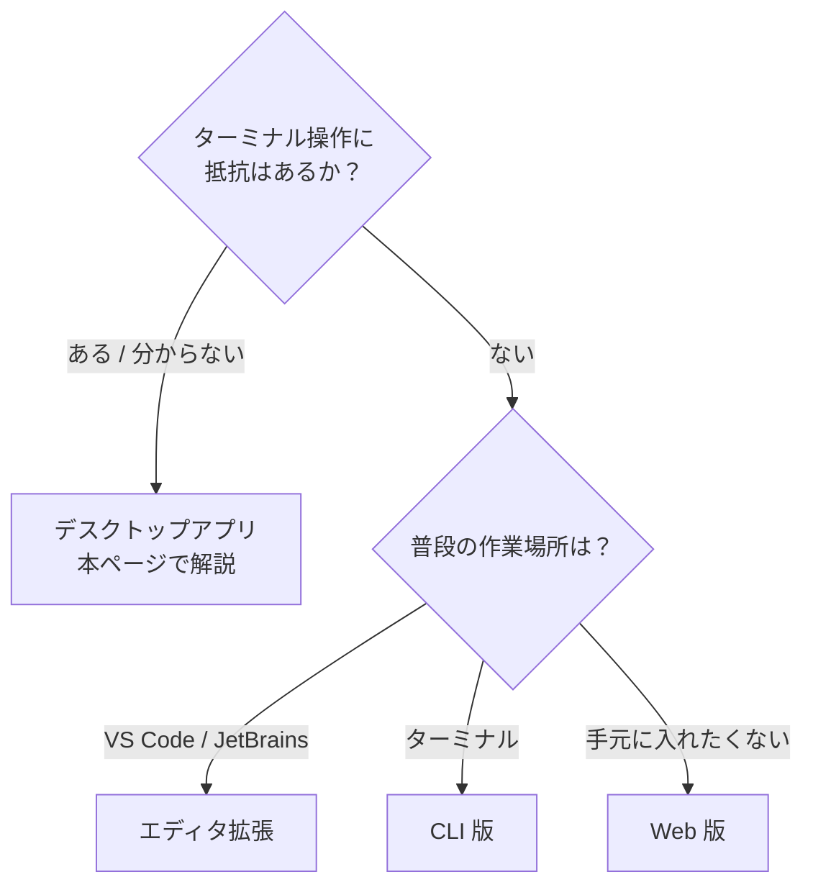

# 3. インストールする

!!! abstract "このページでできるようになること"
    デスクトップアプリを入れて、Claude Code が動く状態にします。**ターミナル（黒い画面）は使いません。**

## どの入口を選ぶか

Claude Code には複数の入口があります。**迷ったらデスクトップアプリ**です。



**このサイトではデスクトップアプリで進めます。** ターミナル操作が要らず、変更内容が差分ビューで目に見え、Claude Code が同梱なので別途インストールも不要だからです。

## 手順1: ダウンロードしてインストール

お使いの OS のリンクからインストーラーを入手して実行します。

=== "Windows"

    - [Windows (x64) 版をダウンロード](https://claude.ai/api/desktop/win32/x64/setup/latest/redirect)
    - [Windows (ARM64) 版をダウンロード](https://claude.ai/api/desktop/win32/arm64/setup/latest/redirect)

    ほとんどのパソコンは x64 版です。Surface など ARM 搭載機の場合のみ ARM64 版を選んでください。

    !!! warning "Windows では Git のインストールが必要です"
        **手元のフォルダを扱うには [Git for Windows](https://git-scm.com/downloads/win) が必要**で、入れていないとローカルのフォルダを選んでも動きません。インストーラーの選択肢は**すべて既定のまま「Next」で構いません。**

        最初のつまずきポイントなので、先に済ませておくことをおすすめします。

=== "Mac"

    - [macOS 版をダウンロード](https://claude.ai/api/desktop/darwin/universal/dmg/latest/redirect)（Intel / Apple Silicon 共通）

    Git は多くの Mac に最初から入っているため、通常は追加作業は不要です。

Linux をお使いの場合は [Linux 版の手順](https://code.claude.com/docs/en/desktop-linux) を参照してください。

## 手順2: サインインして Code タブを開く

1. インストールしたアプリを起動します（Windows はスタートメニュー、Mac はアプリケーションフォルダ）
2. Claude アカウントでサインインします
3. **画面上部中央の「Code」タブ**をクリックします

<!-- TODO(画像): デスクトップアプリの Code タブ。docs/assets/img/desktop-code-tab.png -->

これで準備完了です。

!!! failure "「アップグレードしてください」と出たら"
    無料プランのままです。[2. Pro を契約する](02-pro-plan.md) に戻ってください。サインインし直すよう促された場合は、サインイン後にアプリを再起動します。

画面が開けば準備完了です。上部には Code のほかに Chat（ファイルに触らないチャット）と Cowork（背景で動く自律タスク）のタブがありますが、使い分けは [8. チャットとの使い分け](08-with-chat.md) で扱います。

---

## 参考: 他の入口

デスクトップアプリで進める方は読み飛ばして構いません。

??? note "ターミナル版（CLI）を入れる"

    動作が軽く、他のコマンドと組み合わせられます。

    === "Windows"

        1. スタートメニューで「PowerShell」と検索して開きます（管理者権限は不要）
        2. 次の1行を貼り付けて `Enter`

            ```powershell
            irm https://claude.ai/install.ps1 | iex
            ```

        3. **PowerShell をいったん閉じて開き直します**（これをしないと次のコマンドが見つかりません）
        4. 確認

            ```powershell
            claude --version
            ```

            `2.1.211 (Claude Code)` のようにバージョン番号が出れば成功です。

    === "Mac"

        1. 「ターミナル」を開きます（`command + space` で「ターミナル」と検索）
        2. 次の1行を貼り付けて `Enter`

            ```bash
            curl -fsSL https://claude.ai/install.sh | bash
            ```

        3. ターミナルを開き直して確認

            ```bash
            claude --version
            ```

    使うときは作業フォルダに移動して `claude` と打ちます。初回はブラウザが開くのでサインインを。うまくいかないときは `claude doctor` で自己診断できます。

**エディタ拡張** — VS Code は拡張機能の検索欄で「Claude Code」を探すだけ。JetBrains 系はプラグインに加えてターミナル版の CLI が必要です。

**Web版・モバイル** — [claude.ai/code](https://claude.ai/code) なら手元に何も入れずに使えます。時間のかかる作業を仕掛けて後で結果を見る用途に向いています。

!!! note "2026年8月時点の手順です"
    最新は [デスクトップアプリのクイックスタート](https://code.claude.com/docs/en/desktop-quickstart) を確認してください。

[次へ：最初のセッション :material-arrow-right:](04-first-session.md){ .md-button }
