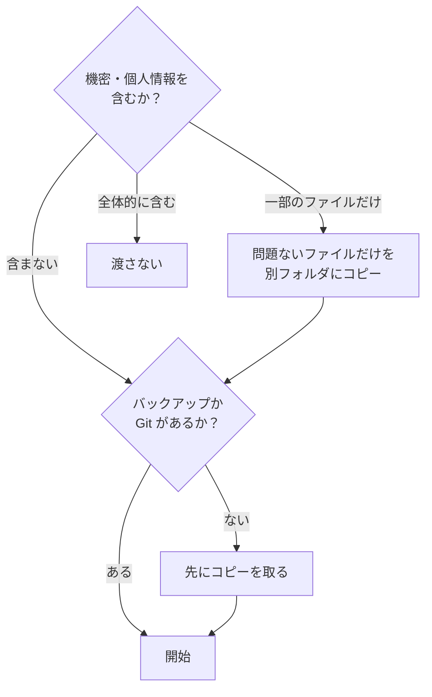
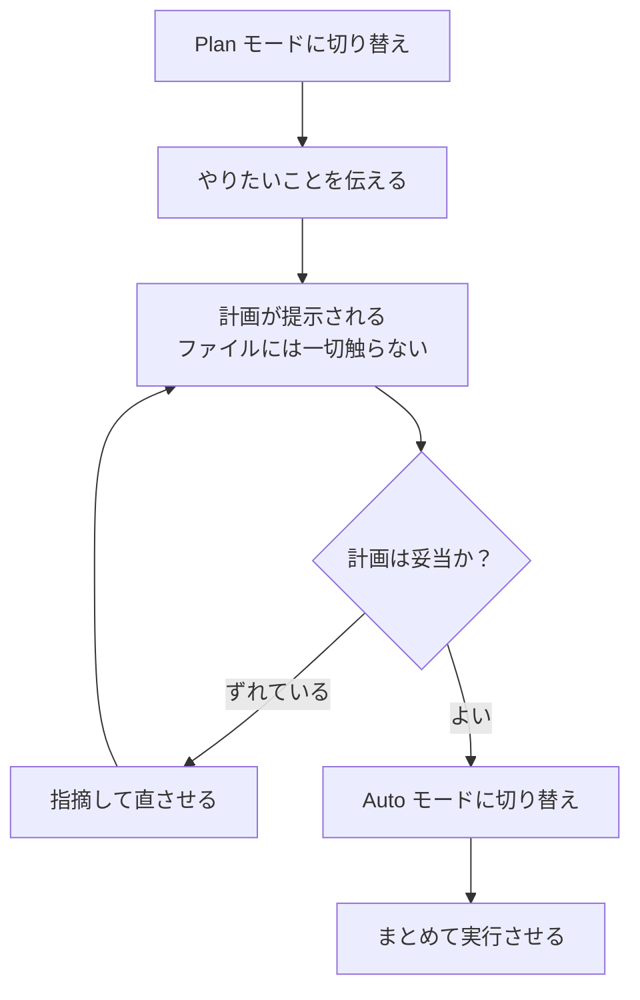

# 4. 最初に動かす

ここで2つだけ実際に動かします。**1つ目は読むだけ**（ファイルを壊しません）、**2つ目で初めて書き換え**を体験します。

## 始める前に

Claude Code は**本当にファイルを書き換えます。** 渡すフォルダは次の基準で選んでください。



判断の基準は **「このフォルダを、社外の取引先にそのまま送れるか？」** の一点です。入力した内容はインターネット越しに Anthropic のサーバへ送られます。会社の情報を扱うなら、まず所属先のルールを確認してください。

**最初は練習用に**、消えても困らないテキストファイルを何個か入れたフォルダを1つ作ることをおすすめします。

## フォルダを開く

1. デスクトップアプリの **Code** タブを開きます
2. 環境は **Local** を選びます（手元のパソコンのファイルを扱うモード）
3. **Select folder** で対象のフォルダを選びます

<!-- TODO(画像): 環境とフォルダの選択。docs/assets/img/select-folder.png -->

---

## 実例1: フォルダの資料を横断して一覧表にする

**読むだけなので、既存のファイルは変わりません。** 最初の1本として安全です。

入力欄に貼り付けてください。`〈〉` の中はご自身の状況に書き換えます。

```text
このフォルダの資料を全部読んで、〈検討中の論点〉ごとに一覧表にしてください。

- 論点 / 書かれている内容 / 出典ファイル名 の3列
- 資料によって内容が食い違う箇所は、その旨を明記する
- 書かれていないことを推測で補わないでください

結果は summary.md というファイルに書き出してください。
```

**返ってくるもの** — 全資料を突き合わせた一覧表が1つのファイルとして手に入ります。「出典ファイル名」を出させておくと、あとで元資料に戻れます。

ファイルが10個あっても30個あっても、**あなたの手数は1回**です。ここがチャットとの決定的な差です。

---

## 実例2: 複数ファイルの表記ゆれを統一する

こちらは**実際にファイルを書き換えます。** 練習用フォルダで試してください。

```text
このフォルダのファイル全部について、次の表記を統一してください。

- 日付は「2026年8月20日」の形式に揃える
- 〈製品名〉の表記を〈正式名称〉に統一する
- 社外の方の名前には「様」を付ける

本文の意味は変えないでください。
まず1つのファイルだけ直して見せてください。それでよければ残りを進めてください。
```

**返ってくるもの** — 表記の揃ったファイル群。

!!! tip "最後の1行が効きます"
    **「まず1つだけ」**と頼むと、いきなり全部書き換えられる事故を防げます。結果を見てから「残りもお願いします」と言えば続きが進みます。この一言は他の作業でも使い回せます。

---

## 進め方：Plan で計画、Auto で実行

送信ボタンの隣に**権限モード**の選択肢があります。おすすめの流れはこうです。



<!-- TODO(画像): 権限モードの選択。docs/assets/img/permission-mode.png -->

**Plan モード**は方針を提案するだけでファイルを変更しません。ここで内容を確認しておけば、**Auto モード**で一気に進めさせても安心です。長い作業ほど、やり直しの時間が丸ごと消えます。

1つずつ差分を見て承認したいときは **Manual モード**を使います。

思っていたのと違う方向に進み始めたら、**停止ボタン**で止められます。止めずに追加の指示を送って軌道修正することもできます。最後まで待つ必要はありません。

## `CLAUDE.md`：毎回の説明をやめる

作業フォルダに **`CLAUDE.md`** というファイルを置いておくと、Claude Code は毎回それを読んでから作業を始めます。

```markdown
# このフォルダについて

営業部の月次報告書を管理しています。

- 日付は「2026年8月20日」の形式に統一してください
- 金額は3桁区切りで書いてください
- `archive/` フォルダの中身は変更しないでください
```

**同じ注意を2回書いたら `CLAUDE.md` に移すサイン**です。`/init` と入力すれば、Claude がフォルダを調べてたたき台を作ってくれます。

## 最後に

出てきた結果の責任は使った人にあります。**数字・日付・固有名詞は自分で確認してから使ってください。** 「AI がやった」は通用しません。

[次へ：この先は自分で :material-arrow-right:](05-next.md){ .md-button }
