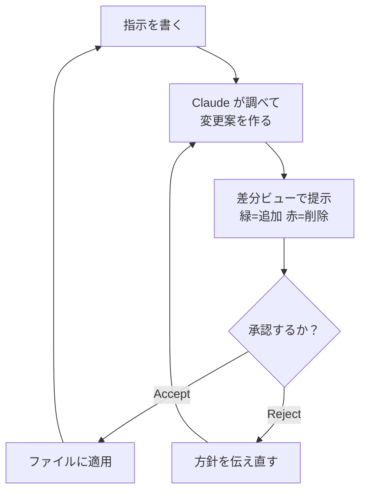

# 4. 最初のセッション

!!! abstract "このページでできるようになること"
    練習用フォルダで実際に動かし、**承認の仕組み**を理解します。ここを押さえれば安全に使えます。

## その前に：練習用フォルダを作る

いきなり大事なフォルダで始めないでください。Claude Code は**本当にファイルを書き換えます。**

1. デスクトップなどに `claude-test` という空のフォルダを作ります
2. 消えても困らないテキストファイルを何個か置きます（既存資料のコピーで可）

!!! warning
    本番のフォルダで使う前に [9. 気をつけること](09-cautions.md) を読んでください。

## 手順1: フォルダを選ぶ

1. デスクトップアプリの **Code** タブを開きます
2. 環境として **Local** を選びます（手元のパソコンのファイルを直接扱うモード）
3. **Select folder** で、さきほど作った `claude-test` を選びます

<!-- TODO(画像): 環境とフォルダの選択画面。docs/assets/img/select-folder.png -->

Cloud・SSH・WSL もありますが、**通常は Local で構いません。**

## 手順2: 権限モードを選ぶ ★重要

送信ボタンの隣に**権限モード**の選択肢があります。**実務上いちばん大事な設定**です。

<!-- TODO(画像): 権限モードの選択。docs/assets/img/permission-mode.png -->

| モード | 挙動 | 使いどころ |
|---|---|---|
| **Manual** | 変更のたびに差分を見せ、**承認を待つ** | **最初はこれ。** ファイルは承認するまで変わりません |
| **Plan** | 方針を提案するだけで**ファイルに触らない** | 大きな作業の前に、何をするか確認したいとき |
| Accept edits | 編集は自動で適用。確認は後から | 慣れてきて、作業が定型化してから |
| Auto | 危険な操作だけ自動で止める | 十分慣れてから |

**最初は Manual を選んでください。** 目で見て理解してから緩めていくのが正解です。

## 手順3: 3つの指示を順に試す

いきなり書き換えさせず、**調べさせる → 考えさせる → 変更させる**の順に進めると感覚がつかめます。

### 1つめ：調べさせる

```text
このフォルダに何があるか調べて、それぞれのファイルの内容を1行で説明してください。
```

読むだけなので何も変わりません。**Claude Code が自分でフォルダを見て回る**様子が確認できます。

### 2つめ：考えさせる

```text
これらのファイルに共通する問題点や、整理したほうがよい点を3つ挙げてください。
まだファイルは変更しないでください。
```

### 3つめ：変更させる

```text
それぞれのファイルの先頭に、内容を1行で表す見出しを追加してください。
```

ここで**承認を求められます。** 次の項へ。

## 手順4: 差分を読んで承認する

Manual モードでは、変更が適用される前に**差分ビュー**が表示されます。1回のやりとりは次のように進みます。



却下すると「ではどうしますか」と聞き返してくるので、そこで方針を伝えられます。**この確認をどこまで省くかが権限モード**です。

<!-- TODO(画像): 承認待ちの状態。docs/assets/img/manual-approval.png -->

適用後は `+12 -1` のような表示が出ます。クリックすると差分ビューが開き、ファイルごとに何が変わったかを見返せます。

<!-- TODO(画像): 差分ビュー。docs/assets/img/diff-view.png -->

!!! tip "差分に直接コメントできます"
    行を指定して「この行はこう直して」と書けば、Claude がそれを読んで修正します。言葉で全部説明するより速いです。

## 途中で止める・軌道修正する

思っていたのと違う方向に進み始めたら、待つ必要はありません。**停止ボタン**で即座に止められますし、止めずに**追加の指示を送る**こともできます（実行を続けながら方向を変えます）。「とりあえず最後まで待つ」のは時間の無駄です。

## 材料の渡し方

**`@`** でフォルダ内のファイルを名前指定できます。画像や PDF は**ドラッグ＆ドロップ**でそのまま渡せます（エラー画面のスクリーンショットや紙資料の写真も読めます）。材料を渡すほど精度が上がるのはチャットと同じです。

!!! note "2026年8月時点の画面です"
    最新は [デスクトップアプリのクイックスタート](https://code.claude.com/docs/en/desktop-quickstart) を確認してください。

## まとめ

- **練習用フォルダ**から始める
- 最初は **Manual モード**。差分を読んでから承認する
- **調べさせる → 考えさせる → 変更させる**の順に進める
- 違うと思ったら**すぐ止める・割り込む**。迷ったら「実行前に手順を説明して」と頼む

[次へ：実例集 :material-arrow-right:](05-examples.md){ .md-button }
