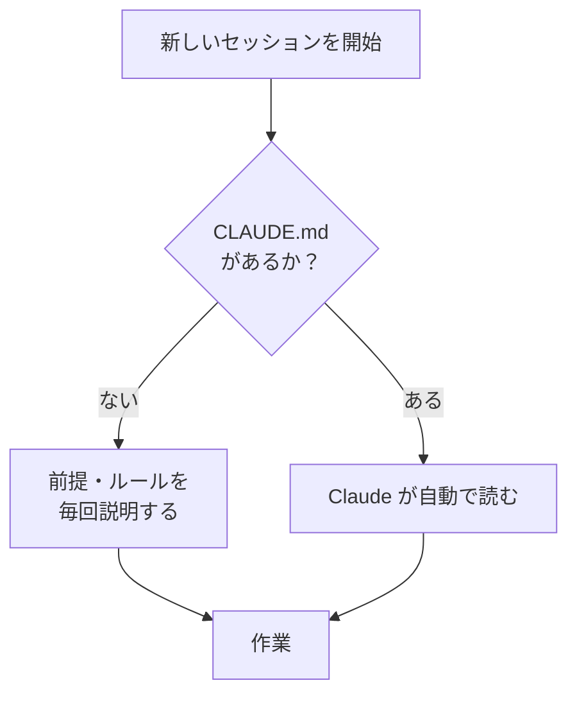

# 7. 使いこなす

!!! abstract "このページでできるようになること"
    毎回の説明を省き、複数の作業を同時に走らせ、定期作業を自動化できるようになります。

## 指示の書き方：4つを書く

うまくいかない指示は、たいてい情報が足りていません。

| | 何を書くか | 例 |
|---|---|---|
| **目的** | 何のためか | 「取引先に提出する資料です」 |
| **材料** | どこを見ればよいか | 「`@template.md` を見本にしてください」 |
| **形式** | どんな形で欲しいか | 「表で」「`summary.md` に保存して」 |
| **制約** | やってほしくないこと | 「元ファイルは変更しないで」「推測で補わないで」 |

特に効くのは**制約**です。「まず1つだけ」「実行前に確認して」の一文があるかどうかで事故の起きやすさが変わります。

## 大きな作業は Plan モードから

権限モードを **Plan** に切り替えてやりたいことを伝え、出てきた方針を読み、合意できたら **Manual** に戻して実行させます。長い作業ほど効き、やり直しの時間が丸ごと消えます。

## `CLAUDE.md`：毎回の説明をやめる

作業フォルダに **`CLAUDE.md`** を置いておくと、Claude Code は毎回それを読んでから作業を始めます。



```markdown
# このフォルダについて

営業部の月次報告書を管理しています。

## お願いしたいこと
- 日付の表記は「2026年8月20日」の形式に統一してください
- 金額は3桁区切りで書いてください
- 社外の方の名前には「様」を付けてください

## 触らないでほしいもの
- `archive/` フォルダの中身は変更しないでください
- `原本/` は読むだけにしてください
```

**同じ注意を2回書いたら `CLAUDE.md` に移すサイン**です。`/init` と入力すれば、Claude がフォルダを調べてたたき台を作ってくれます。

!!! tip "作業しながら覚えていきます"
    Claude Code は作業の中で得た知識（どのコマンドで動くか、何が落とし穴か）も自分で記録していきます。使うほど説明が少なくて済みます。

## スラッシュコマンドとスキル

入力欄で `/` を打つ（または `+` ボタン）と、使えるコマンドの一覧が出ます。

<!-- TODO(画像): スラッシュコマンドの一覧。docs/assets/img/slash-commands.png -->

| コマンド | 何をするか |
|---|---|
| `/help` | 使えるコマンドの一覧 |
| `/clear` | 会話をリセットして仕切り直す |
| `/init` | `CLAUDE.md` のたたき台を作る |

**繰り返す作業は「スキル」として登録**できます。毎月の棚卸しや決まったチェック項目を手順として書いておけば、`/` から呼び出すだけ。チームで共有もできます。

## 会話が長くなったら `/clear`

作業が進むと Claude が抱える情報が増え、増えすぎると精度が落ちます。**話題が変わったら `/clear`。** 前提は `CLAUDE.md` にあるので、リセットしても説明し直す必要はありません。

## 並列セッション：同時に走らせる

サイドバーから**複数のセッションを同時に開けます。** それぞれ独立した文脈を持つので混ざらず、片方に長い作業をさせている間にもう片方で別の相談ができます。本筋を止めたくない小さな質問には**サイドチャット**も使えます。

<!-- TODO(画像): 並列セッション。docs/assets/img/parallel-sessions.png -->

## 定期作業を自動化する

「毎週月曜に議事録フォルダを棚卸しして未完了を報告」——こうした作業は**スケジュール実行**に載せて放っておけます。自分のパソコン上で動くもの（手元のファイルを扱える）と、クラウドで動くもの（パソコンを閉じていても動く）の2種類があります。

## 外部ツールとつなぐ（MCP・コネクタ）

**MCP** という仕組みで、Google Drive の資料を読む、Jira のチケットを更新する、Slack を参照する、といった具合に**手元のフォルダ以外にも広げられます。** 設定手順はここでは扱いません（[MCP のクイックスタート](https://code.claude.com/docs/en/mcp-quickstart)）。

## 場所を移して続ける

セッションは1つの入口に固定されません。外出先ではモバイル、席に戻ったらデスクトップ、時間のかかる作業はクラウドに投げて後で結果だけ確認、といった移動ができます。

!!! note "2026年8月時点の機能です"
    Claude Code は更新が非常に速いサービスです。最新は [公式ドキュメント](https://code.claude.com/docs/en/overview) を確認してください。

[次へ：チャットとの使い分け :material-arrow-right:](08-with-chat.md){ .md-button }
