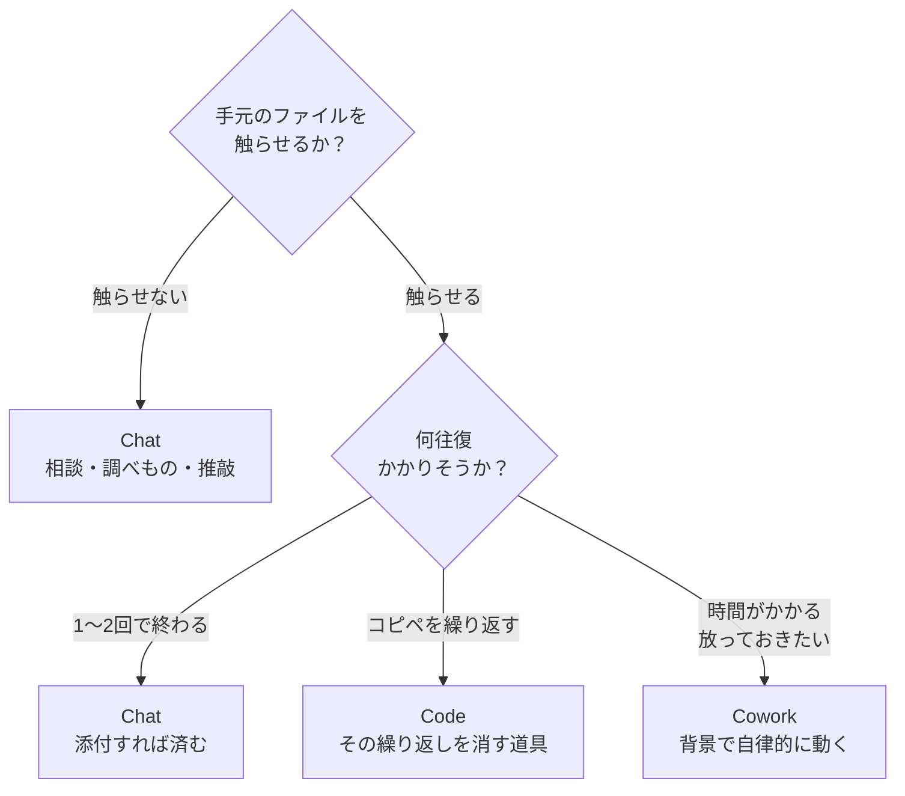

# 8. チャットとの使い分け

!!! abstract "このページでできるようになること"
    「今回はチャットか、Claude Code か」で迷わなくなります。

## 3つのタブ

デスクトップアプリの上部には3つのタブがあります。ここが使い分けの入口です。

| タブ | 性質 | 使うとき |
|---|---|---|
| **Chat** | **ファイルに触らない**。普通のチャット | 相談、調べもの、文章の推敲 |
| **Code** | **手元のファイルを直接扱う** | 実際の作業。このサイトの主題 |
| **Cowork** | 隔離された環境で**自律的に動く背景タスク** | 時間のかかる作業を任せて放置する |

Chat の中身は、他社の AI チャットとできることがほぼ同じです。使い方の説明が要らない程度には素直なので、このサイトでは詳しく扱いません。

## 判断のしかた

迷ったら、この順に自問してください。

判断の分かれ目は**往復回数**です。1〜2回で終わるならチャットのほうが手軽で、繰り返しが見えたら Code に移ります。

## 具体的な振り分け

| やりたいこと | どちら |
|---|---|
| メールの文面を考えてもらう | Chat |
| 知らない制度について教えてもらう | Chat |
| 企画のたたき台を出してもらう | Chat |
| 自分の案の穴を突いてもらう | Chat |
| 1つの PDF を要約する | Chat（添付すれば済む） |
| **フォルダ内の30個の資料をまとめる** | **Code** |
| **複数ファイルの表記を統一する** | **Code** |
| **ファイルを仕分けてリネームする** | **Code** |
| **集計スクリプトを書いて実行する** | **Code** |
| **時間のかかる調査を投げて放置する** | **Cowork** または Code のクラウド実行 |

## 併用の実際の流れ

現実には、行き来しながら使います。

1. **Chat** で「こういうことがしたいんだけど、どういう進め方が考えられる？」と壁打ちする
2. 方針が固まったら **Code** に移り、フォルダを渡して実行させる
3. 途中で「この書き方でいいか」と迷ったら、**サイドチャット**で聞く（本筋の作業を止めずに済みます）

Code タブの中でも、ファイルを触らせずに相談だけすることは普通にできます。**厳密に分ける必要はありません。**

## ブラウザ版・モバイル

- **ブラウザ版 [claude.ai](https://claude.ai)** — アプリを入れていないパソコンから。チャットはここで完結します
- **モバイルアプリ** — 移動中の下書き、思いついたことのメモ。あとでパソコンで続きができます
- **[claude.ai/code](https://claude.ai/code)** — ブラウザから Claude Code を使う入口。手元に環境がなくても動きます

会話はアカウントに紐づいているので、どこで始めてもあとから続けられます。

[次へ：気をつけること :material-arrow-right:](09-cautions.md){ .md-button }
