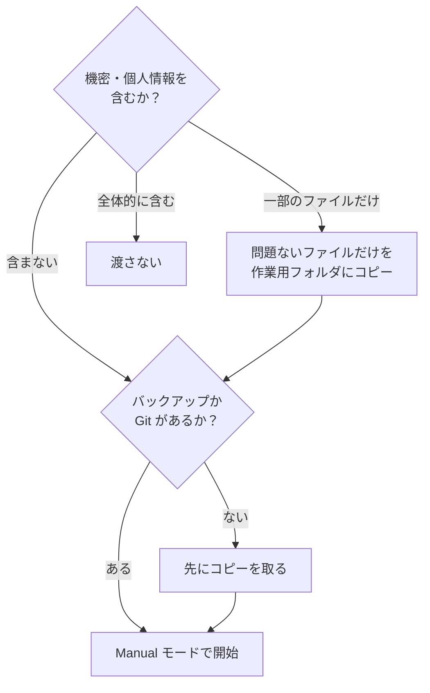

# 9. 気をつけること

!!! abstract "このページでできるようになること"
    事故を防ぐための線引きが分かります。**このページだけは全員読んでください。**

Claude Code は**実際にファイルを書き換え、コマンドを実行します。** 便利さと危うさは同じ場所から来ています。

---

## 1. 元に戻せる状態で使う

いちばん大事な原則です。**バックアップ**か **Git** で戻せる状態にし、練習は**コピーしたフォルダ**で、本番で初めて動かすときは **Manual モード**で差分を1つずつ確認してください。

!!! danger "取り返しがつかないもの"
    バックアップのない大事なファイル、共有フォルダの原本、本番環境。**これらでいきなり試さないでください。**

## 2. 権限モードを緩めるのは慣れてから

| モード | リスク |
|---|---|
| **Manual** | 低い。承認するまでファイルは変わらない |
| Plan | ほぼなし。提案するだけ |
| Accept edits | 中。編集が自動で適用される |
| Auto | 高め。危険な操作は自動で止まるが、判断を委ねている |

**「今後も許可」を安易に選ばないでください。** 一度緩めると意図しない変更に気づけなくなります。作業が定型化し、何が起きるか予想がつくようになってから緩めるのが順序です。削除やフォルダの一括操作を求められたときは特に注意してください。

## 3. 認証情報のあるフォルダで作業しない

パスワード、API キー、社内システムのログイン情報、証明書。これらが入ったフォルダは作業対象から外してください。`CLAUDE.md` に「読まないで」と書くこともできますが、**そもそも渡さないのが確実**です。

---

## 4. 入力した内容は社外に送られている

Claude Code はあなたのパソコンの中だけで動いているのではなく、**内容がインターネット越しに Anthropic のサーバへ送られて処理されます。**

つまり読ませたファイルは**社外のサービスにアップロードした**のと同じです。フォルダごと渡す道具なので、**チャットより影響範囲が大きい**点に注意してください。

### 渡してはいけないもの

まず**所属先のルールを確認**してください。ルールがない場合でも、次のものは避けるのが無難です。

- **個人情報** — 氏名・住所・電話番号・マイナンバー・健康や病歴に関する情報
- **顧客から預かったデータ** — 契約上、社外に出せないことがほとんどです
- **未公開の経営情報** — 決算数値、人事情報、新製品の情報
- **認証情報** — パスワード、API キー
- **他社の秘密情報** — 秘密保持契約を結んで受け取った資料

### 渡してよいか迷ったら

判断の基準は **「このフォルダを、社外の取引先にそのまま送れるか？」** の一点です。

「フォルダ全部は渡せないが、この5ファイルなら問題ない」という場合は、**必要なファイルだけをコピーした作業用フォルダ**を作るのが現実的な落としどころです。

### 設定を確認しておく

**Settings → Privacy** にデータの扱いに関する項目があります。業務で使う前に一度目を通してください。会社が Team / Enterprise で契約している場合は条件が異なるので管理者に確認を。

---

## 5. 出した結果の責任は使った人にある

書き換えたファイルをそのまま提出して内容が間違っていた場合、**責められるのはあなた**です。「AI がやった」は通用しません。**必ず自分で差分を読んでから確定してください。** 特に数字・日付・固有名詞。

Claude Code は自分で実行して確認する分チャットより信頼できますが、**確認の責任は消えません。**

---

## 6. 社内で使うときの進め方

1. まず**公開情報だけ**、または**自分だけが使うファイル**で試して、有用性を確かめる
2. 情報システム部門・法務に、業務利用の可否とルールを確認する
3. **「渡してよい情報」の線引きをチームで文章にする**
4. その範囲内で本格的に使い始める

3 が抜けたまま広がるのがいちばん危ないので、**書いて共有する**ことをおすすめします。

---

## まとめ

- **元に戻せる状態**で使う。バックアップか Git
- **Manual モード**から始め、差分を読んでから承認する
- 判断基準は「**このフォルダを取引先にそのまま送れるか**」
- **確認の責任は自分にある**

[次へ：FAQ・トラブル対応 :material-arrow-right:](10-faq.md){ .md-button }
