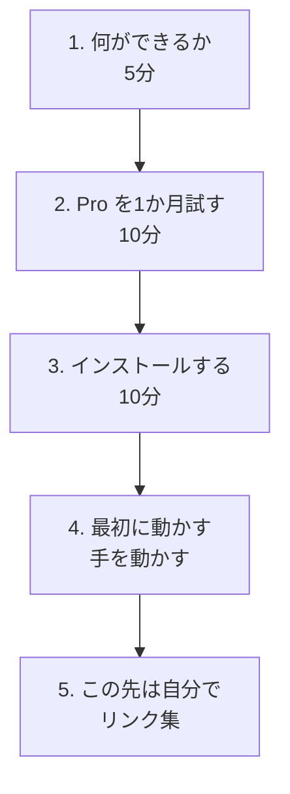

# Claude Code を1か月試す

AI チャットは、もうどこの会社のものでも似たようなことができます。**このサイトが紹介するのは、その先にある Claude Code です。**

> パソコンの中のフォルダを渡すと、**自分でファイルを探して、読んで、書き換えて、実行して結果を確かめる**ところまでやります。

チャットに1ファイルずつ貼って、返ってきた文章をコピーして貼り戻す——あの往復が丸ごと消えます。

## このサイトの立場

Claude Code の使い方そのものは、すでに世の中に情報が溢れています。**このサイトは、そこにたどり着く手前だけを扱います。**

- 何ができるのか
- どう契約するか（**1か月だけ試す方法**）
- どうやって入れるか
- 最初の1本を動かすところまで

そこから先は、興味の向いた方向にご自身で調べてください。そのほうが速いです。

!!! warning "無料では使えません"
    Claude Code には **Pro プラン（月 $20）** が必要です。ただし**契約した直後に解約手続きをしても、その1か月は使えます。** 課金を1回だけに抑えて試せます。やり方は [2. Pro を1か月試す](02-pro-trial.md)。

## 道順

読むだけなら25分ほどです。

[はじめる :material-arrow-right:](01-what-it-does.md){ .md-button .md-button--primary }

!!! note "2026年8月時点の情報です"
    料金・画面・手順は変わることがあります。各ページに公式サイトへのリンクを載せています。
