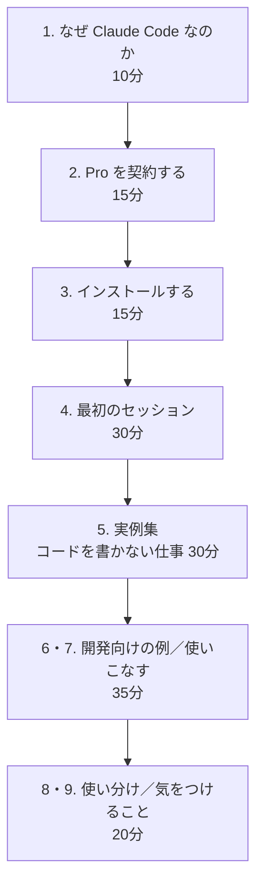

# Claude Code のすすめ

対話型の AI チャットは、もうどこの会社のものでも似たようなことができます。ChatGPT でも Gemini でも Claude でも、質問すれば答えが返ってきます。

**このサイトが紹介するのは、その先です。**

> **Claude Code は、あなたのパソコンの中のフォルダを渡すと、自分でファイルを探して、読んで、書き換えて、必要ならコマンドを実行して結果を確かめるところまでやります。**

チャットに1ファイルずつ貼り付けて、返ってきた文章をコピーして貼り戻す——あの往復が丸ごと不要になります。

## チャットとの違い

| | チャット型 AI | Claude Code |
|---|---|---|
| ファイル | 1つずつ自分で貼る | **フォルダごと渡す。自分で探して読む** |
| 反映 | 結果をコピーして自分で貼り戻す | **ファイルを直接書き換える** |
| 手数 | 1往復につき1つの作業 | **一度の指示で複数の手順を自分で進める** |

詳しくは [1. なぜ Claude Code なのか](01-why-claude-code.md) で、実際の作業を例に説明します。

## プログラマー向けの道具ではないのか

もともとはそうでした。ですが実際に効くのは、**「複数のファイルにまたがる、手数の多い作業」全般**です。

- 30個の資料を全部読んで一覧表にする
- フォルダ中のファイルの表記ゆれを一括で直す
- 中身を見て仕分けしてリネームする
- バラバラの報告書を1つの様式に揃える

こうした仕事に心当たりがあるなら、コードを書かなくても使えます。**デスクトップアプリを使えば、黒い画面（ターミナル）は一切不要**です。このサイトはそちらを主軸に説明します。

## 先に知っておくこと

!!! warning "無料では使えません"
    Claude Code を使うには **Pro プラン（月 $20）以上の契約が必要**です。無料プランでは使えません。詳しくは [2. Pro を契約する](02-pro-plan.md)。

## 道順

全体でおよそ2時間半、途中で中断しても構いません。

**6 はコードを書く人向け**なので、そうでない方は飛ばして構いません。**9 は全員読んでください。**

各ページの詳しい内容は、左のメニューから直接開けます。

[はじめる :material-arrow-right:](01-why-claude-code.md){ .md-button .md-button--primary }

!!! note "情報の鮮度について"
    料金・画面・手順は **2026年8月時点**のものです。Claude Code は更新が非常に速いので、画面が少し違っていても慌てないでください。各ページに公式サイトへのリンクを載せています。
